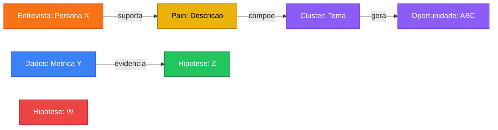

# Evidence Board — Mapa Visual de Evidencias

## Proposito

Gera um painel visual (Mermaid) conectando todas as evidencias do discovery. O PM invoca `/evidence-board` a qualquer momento pra ver o estado do conhecimento acumulado.

## Fluxo

### 1. Escanear Outputs

Buscar arquivos nos diretorios do projeto ativo:
- **Entrevistas:** `1-problem/1a-interview-analysis/*.md`
- **Pain Points:** `1-problem/1b-painpoints/1b1-painpoints-breakdown/*.md` (clusters)
- **Pain Points Granulares:** `1-problem/1b-painpoints/1b0-granular/*.md`
- **Data Landscape:** `1-problem/0-data-landscape/data-landscape.md`
- **Hipoteses:** `1-problem/0-data-landscape/hypotheses.md`
- **JTBDs:** `1-problem/1b-painpoints/1b2-jtbd/*.md`
- **Roteiro:** `0-documentation/0a-projectdocs/interview-script.md`
- **Oportunidades:** `2-solution/2a-opportunities/*.md`

Extrair de cada arquivo: titulo, tipo, conexoes mencionadas.

### 2. Gerar Grafo Mermaid

Construir `graph LR` com conexoes: Entrevistas->Pain Points, Dados->Hipoteses, Pains->Clusters->Oportunidades.



**Cores:** laranja=entrevista, azul=dados, amarelo=pain point, verde=validado, vermelho=invalidado, roxo=oportunidade.

### 3. Gerar Tabela Resumo

| Fonte | Insight | Confianca | Status |
|-------|---------|-----------|--------|
| Entrevista: Persona X | Pain point descrito | Alta (3+ fontes) | Validado |
| Dados: Metrica Y | Hipotese Z confirmada | Media (1 fonte) | Em teste |

**Confianca:** Alta (3+ fontes), Media (1-2 fontes), Baixa (fonte unica).

### 4. Salvar Output

Salvar em `_exports/evidence-board.md` com estrutura:
```markdown
# Evidence Board — {Nome do Projeto}
**Gerado em:** {data} | **Fontes escaneadas:** {N} arquivos

## Mapa de Evidencias
{diagrama Mermaid}

## Tabela de Rastreabilidade
{tabela fonte -> insight -> confianca -> status}

## Cobertura
- Entrevistas: X | Pain points: Y | Hipoteses: Z (V validadas, I invalidadas, T em teste) | Oportunidades: W
```

Informar ao PM o caminho do arquivo e resumo de cobertura.

## Modos de Visualizacao

Perguntar ao PM qual modo prefere (ou detectar automaticamente pelo perfil):

### Modo Simples (recomendado pra PMs iniciantes)
- Tabela de rastreabilidade APENAS (sem Mermaid)
- Formato: Fonte → Insight → Confianca → Status
- Maximo 15 linhas
- Linguagem acessivel, sem termos tecnicos

### Modo Completo (pra PMs experientes)
- Grafo Mermaid + tabela de rastreabilidade + cobertura
- Ate 30 nos no grafo (limite do Mermaid pra legibilidade)
- Inclui cross-cluster connections e confidence scoring
- Se >30 nos: sugerir Modo Interativo

### Modo Interativo (pra projetos grandes ou apresentacoes)
Gera HTML standalone com grafo SVG interativo. Sem dependencia de CDN — funciona offline.

**Output:** `_exports/evidence-board-interactive.html`

**Template HTML:**
```html
<!DOCTYPE html>
<html lang="pt-BR">
<head>
<meta charset="UTF-8">
<title>Evidence Board — {Projeto}</title>
<style>
  body { font-family: -apple-system, sans-serif; margin: 0; padding: 20px; background: #f8fafc; }
  .board { display: flex; gap: 20px; }
  .graph { flex: 2; background: white; border-radius: 12px; padding: 20px; box-shadow: 0 1px 3px rgba(0,0,0,0.1); }
  .sidebar { flex: 1; }
  .node { cursor: pointer; transition: transform 0.2s; }
  .node:hover { transform: scale(1.1); }
  .card { background: white; border-radius: 8px; padding: 12px; margin-bottom: 8px; box-shadow: 0 1px 2px rgba(0,0,0,0.05); }
  .interview { border-left: 4px solid #f97316; }
  .data { border-left: 4px solid #3b82f6; }
  .pain { border-left: 4px solid #eab308; }
  .opportunity { border-left: 4px solid #8b5cf6; }
  .validated { border-left: 4px solid #22c55e; }
  .filter { display: flex; gap: 8px; margin-bottom: 16px; }
  .filter button { padding: 6px 12px; border: 1px solid #e5e7eb; border-radius: 6px; background: white; cursor: pointer; }
  .filter button.active { background: #2563eb; color: white; border-color: #2563eb; }
  @media print { .filter { display: none; } }
</style>
</head>
<body>
<h1>Evidence Board — {Projeto}</h1>
<div class="filter">
  <button class="active" onclick="filterAll()">Todos</button>
  <button onclick="filter('interview')">Entrevistas</button>
  <button onclick="filter('data')">Dados</button>
  <button onclick="filter('pain')">Pain Points</button>
  <button onclick="filter('opportunity')">Oportunidades</button>
</div>
<div class="board">
  <div class="graph">
    <svg id="graph" width="100%" height="600">
      <!-- Gerar nos e conexoes como <circle>, <line>, <text> SVG -->
      <!-- Cada no: <g class="node {type}" data-type="{type}"> -->
      <!-- Conexoes: <line class="edge" x1="..." y1="..." x2="..." y2="..." /> -->
    </svg>
  </div>
  <div class="sidebar" id="details">
    <h3>Clique num no pra ver detalhes</h3>
  </div>
</div>
<script>
// Layout: posicionar nos em colunas por tipo (esquerda→direita: entrevistas→pains→clusters→oportunidades)
// Click handler: mostrar detalhes no sidebar
// Filter: toggle visibilidade por tipo
function filter(type) {
  document.querySelectorAll('.node').forEach(n => {
    n.style.display = type === n.dataset.type || !type ? 'block' : 'none';
  });
}
function filterAll() { document.querySelectorAll('.node').forEach(n => n.style.display = 'block'); }
</script>
</body>
</html>
```

**Regras do Modo Interativo:**
- Gerar nos SVG posicionados em colunas por tipo (flow esquerda→direita)
- Cada no clicavel: mostra fonte, insight, confianca no sidebar
- Filtros por tipo (toggle buttons)
- Funciona 100% offline (zero CDN)
- Escala ate 100+ nos (SVG nao tem limite como Mermaid)
- Print-friendly (filtros somem no @media print)

### Deteccao automatica
- Se PM usou /pair e fez <3 sessoes → Modo Simples
- Se projeto tem 5-30 outputs → Modo Completo (Mermaid)
- Se projeto tem >30 outputs → Modo Interativo (HTML/SVG)
- Se PM pedir explicitamente → respeitar

## Guardrails

- Nunca inventar conexoes — so mapear o que esta explicito nos arquivos
- Manter `[Source: arquivo.md]` em cada linha da tabela
- Se nao houver outputs, informar o PM e sugerir proximo passo
- Maximo 50 nos no grafo — agrupar se necessario pra legibilidade
