# Modernizacao do Sistema de Agentes ups-askQuestion

## Diagnostico: Padroes Antigos vs Modernos

O sistema atual usa exclusivamente `.mdc` rules com `alwaysApply: true/false` e `description` como trigger. Isso foi o melhor disponivel ha 1 ano, mas tem problemas:

- **Guardrails-police.mdc (258 linhas, alwaysApply: true)**: Consome tokens em TODA interacao, mesmo quando irrelevante
- **Orquestrador (898 linhas)**: Monolitico demais para uma unica rule
- **13 agent rules**: Ativadas por description matching, sem script de validacao real
- **Nenhum hook**: Guardrails sao "sugestoes" ao modelo, nao enforcement real
- **Nenhuma skill**: Conhecimento de dominio embutido nas rules em vez de discoverable skills
- **Referencias quebradas**: `_agents/` inexistente, scripts de validacao ausentes

---

## Arquitetura Proposta

```mermaid
graph TB
  subgraph hooksLayer [Hooks Layer - Deterministic]
    preEdit["beforeSubmitPrompt<br/>Injeta contexto do projeto"]
    postEdit["afterFileEdit<br/>Valida guardrails"]
    afterAgent["afterAgentComplete<br/>Quality gate check"]
  end
  
  subgraph rulesLayer [Rules Layer - Lean]
    guardrails["guardrails-core.mdc<br/>~50 linhas, alwaysApply"]
    orchestrator["orchestrator.mdc<br/>~200 linhas, trigger por frase"]
  end
  
  subgraph skillsLayer [Skills Layer - On Demand]
    s0["agent-0-context/SKILL.md"]
    s1["agent-1-research/SKILL.md"]
    s2a["agent-2a-granular/SKILL.md"]
    s2b["agent-2b-clustering/SKILL.md"]
    s3["agent-3-journey/SKILL.md"]
    s4["agent-4-consolidation/SKILL.md"]
    s5["agent-5-report/SKILL.md"]
    s6v["agent-6-visual/SKILL.md"]
    s6s["agent-6s-ideation/SKILL.md"]
    s7["agent-7-experience/SKILL.md"]
    s8["agent-8-concept/SKILL.md"]
    s9["agent-9-prioritization/SKILL.md"]
    s10["agent-10-communication/SKILL.md"]
    s11["agent-11-confluence/SKILL.md"]
    s12["agent-12-jira/SKILL.md"]
    researcher["researcher/SKILL.md"]
  end
  
  subgraph refsLayer [References - Progressive Disclosure]
    templates["templates/<br/>Output templates"]
    examples["examples/<br/>Exemplos reais"]
    scripts["scripts/<br/>Validacao, formatacao"]
  end
  
  hooksLayer --> rulesLayer
  rulesLayer --> skillsLayer
  skillsLayer --> refsLayer
```




---

## Mudanca 1: Rules Enxutas (de ~4400 linhas para ~400)

**Problema**: Rules atuais carregam conhecimento de dominio completo + instrucoes de orquestracao + templates, consumindo tokens desnecessariamente.

**Solucao**: Manter apenas 2-3 rules lean:

### `guardrails-core.mdc` (~50 linhas, alwaysApply: true)

- Apenas as regras CRITICAS condensadas (no dollar amounts, source tags, estimation tags)
- Remover exemplos, enforcement protocol, e response formats (vao para hook script)
- Referencia: atualmente em [guardrails-police.mdc](.cursor/rules/guardrails-police.mdc) com 258 linhas

### `orchestrator.mdc` (~200 linhas, trigger por frase)

- Manter: sequencia de agentes, AskQuestion protocol, decision points
- Remover: descricoes detalhadas de cada agente (vao para skills)
- Referencia: atualmente [agent-workflow-orchestrator.mdc](.cursor/rules/agent-workflow-orchestrator.mdc) com 898 linhas

### Remover todas as 13 agent rules individuais de `.cursor/rules/`

- Conteudo migra para Skills (ver Mudanca 3)

---

## Mudanca 2: Hooks para Guardrails Deterministicos

**Problema**: `guardrails-police.mdc` e uma "sugestao" ao modelo. Ele pode ignorar, esquecer, ou aplicar parcialmente. Nao ha enforcement real.

**Solucao**: Criar `.cursor/hooks.json` + scripts de validacao:

### `.cursor/hooks.json`

```json
{
  "version": 1,
  "hooks": {
    "afterFileEdit": [
      {
        "command": "python3 .cursor/scripts/validate-guardrails.py",
        "matcher": "^(1-problem|2-solution|3-delivery)/.*\\.md$"
      }
    ]
  }
}
```

### `.cursor/scripts/validate-guardrails.py`

Script que valida deterministicamente:

- Regex para dollar amounts sem tag `[AI estimation]`
- Regex para percentuais sem `[Source:]` ou `[AI estimation]`
- Checagem de `[Source: filename.md]` em claims
- Retorna exit code 2 para bloquear se violacao critica

**Beneficio**: Guardrails deixam de ser "sugestoes" e passam a ser **enforcement real e deterministico** que nao consome tokens.

---

## Mudanca 3: Skills com Dynamic Context Discovery

**Problema**: Cada agent rule (.mdc) esta sempre competindo por ativacao via description matching. Agente 12 (Jira, 333 linhas) e carregado mesmo quando o usuario esta fazendo analise de entrevistas.

**Solucao**: Converter cada agente em um SKILL.md com progressive disclosure.

### Estrutura proposta: `.cursor/skills/`

```
.cursor/skills/
  agent-0-context-specialist/
    SKILL.md              # ~100 linhas: instrucoes core
    references/
      template.md         # Template de output (link para _output-structure)
  agent-1-research-specialist/
    SKILL.md
    references/
      interview-template.md
  agent-2a-granular-specialist/
    SKILL.md
    references/
      granular-template.md
  ...
  researcher/
    SKILL.md              # Synthetic users research workflow
    references/
      roteiro-template.md
  guardrails-validator/
    SKILL.md              # Validacao manual sob demanda
    scripts/
      validate-guardrails.py
```

### Formato de cada SKILL.md (exemplo Agent 1):

```markdown
---
name: agent-1-research-specialist
description: Analyzes qualitative interview data, extracts structured pain points, emotional journeys, and behavioral patterns. Use when processing interviews, analyzing user research, or running Agent 1 in the upstream workflow.
---

# Agent 1 - Qualitative Research Specialist

## Input
- Interview files from `/0-documentation/0b-Interviews/`
- Broad context from `/0-documentation/broad-context.md`

## Process
1. Read broad-context.md for project scope
2. Process each interview exhaustively
3. Extract pain points WITHOUT type classification (left for Agent 2)
4. Map emotional journey and behavioral patterns

## Output
- `{name}-analysis.md` in `/1-problem/1a-interview-analysis/`
- Use template from [references/interview-template.md](references/interview-template.md)

## Quality Gates
- All interviews processed
- Pain points have: quote, context, frequency, severity, impact
- No TYPE classification (reserved for Agent 2A)
- Source attribution on every claim
```

**Beneficio**: Skills so carregam quando o contexto e relevante (Dynamic Context Discovery), economizando ~4000 tokens por interacao.

---

## Mudanca 4: Compatibilidade Cross-Tool

### Claude Code

Criar `.claude/settings.json` com hooks equivalentes e `AGENTS.md` na raiz:

```
AGENTS.md                    # Descricao do workflow para Claude Code
.claude/
  settings.json              # Hooks config
  skills/                    # Symlinks para .cursor/skills/
```

### Portabilidade de Skills

O formato SKILL.md e um open standard suportado por 27+ agents. Adicionar tambem:

```
.agents/skills/              # Formato universal
```

---

## Mudanca 5: Correcoes de Consistencia

Resolver as inconsistencias identificadas na avaliacao 360:

- **README.md**: Reescrever para refletir arquitetura real (13 agentes, 3 fases, paths corretos)
- **Agent numbering**: Resolver conflito Agent 6 (Problem) vs Agent 6 (Solution) — renomear Solution para S6, S7... ou P6, S6
- **Agent 8 duplicado**: Decidir qual manter (`solution-concept` vs `communication`)
- **Phase 3 naming**: Padronizar `3-delivery/` (nao `3-development/`)
- **Typo**: `2c-priotization/` para `2c-prioritization/`
- **Comandos Cursor**: Atualizar paths em `entrevista.md` e `validacao.md`

---

## Mudanca 6: Orquestrador como Subagent Coordinator

**Problema**: O orquestrador atual tenta fazer tudo numa unica rule de 898 linhas.

**Solucao**: O orquestrador lean (200 linhas) coordena subagents nativos do Cursor 2.4:

- Cada agente e invocado como subagent via Task tool
- Subagents herdam o skill relevante automaticamente
- Ate 4 subagents em paralelo (ex: Agent 5 + Agent 6 simultaneamente)
- O orquestrador foca em: sequencia, decisoes, quality gates

---

## Resumo de Impacto


| Dimensao             | Antes                                     | Depois                                     |
| -------------------- | ----------------------------------------- | ------------------------------------------ |
| Tokens por interacao | ~4400 linhas de rules competindo          | ~400 linhas rules + skill sob demanda      |
| Guardrails           | Sugestao ao modelo (pode ignorar)         | Hook deterministico + rule lean            |
| Ativacao de agentes  | Description matching (impreciso)          | Skills com Dynamic Context Discovery       |
| Compatibilidade      | Apenas Cursor (formato .mdc proprietario) | Cursor + Claude Code + 27 agents           |
| Documentacao         | README desatualizado, refs quebradas      | Alinhado, refs funcionais                  |
| Validacao            | Nenhum script real                        | `validate-guardrails.py` real e executavel |


